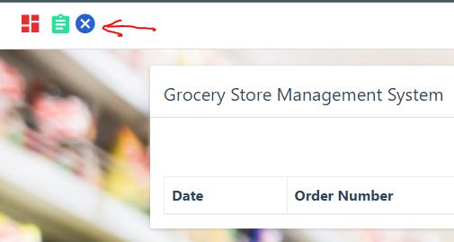

 <h1 align=center>Final Project: Grocery Web Application</h1>

The source codes and other resources for for the application deployed can be found in this **[link here](https://github.com/codebasics/python_projects_grocery_webapp)** on [codebasics](https://github.com/codebasics).

👉Link to instructions from Kura Labs: [here](https://github.com/kura-labs-org/FINAL_PROJECT_C2)
## Goal:
In this python project, we will build a grocery store management application. It will be **three-tier** application with:

1. Front end: UI (User Interface) is written in HTML/CSS/Javascript/Bootstrap

2. Backend: Python and Flask

3. Database: RDS mysql

## Architecture:


## Software Tools:

   * **AWS account**: set up an [account](https://docs.aws.amazon.com/polly/latest/dg/setting-up.html) and a user.
   * **AWS:** Cognito, RDS, EC2, CloudWatch
   * **CI/CD Pipeline:** Circle CI
   * **Infrastructure as Code (IaC):** Terraform
   * **Testing:** Cypress


## Procedure:

### Part 1 - Building the app locally

### Part 2 - Setting up RDS database and deploying on the cloud

1. Create an Ubuntu/Linux AWS [EC2 instance](https://medium.com/@jameshamann/setting-up-an-ubuntu-ec2-instance-from-scratch-78a166167a22).
2. Install Nginx. Use this [link](https://www.nginx.com/blog/setting-up-nginx/).
3. Copy the files to this path. You can also [clone](https://docs.github.com/en/repositories/creating-and-managing-repositories/cloning-a-repository) the [repository](https://github.com/codebasics/python_projects_grocery_webapp) and delete files that are not used for the application. 
```
cd /usr/share/nginx/html
```
4. Install mysql client on the EC2. You can follow this [tutorial](https://linuxconfig.org/install-mysql-on-ubuntu-20-04-lts-linux).
5. Created [RDS](https://docs.aws.amazon.com/AmazonRDS/latest/UserGuide/USER_CreateDBInstance.html) database on AWS.
6. Set up the schema of the data tables on your local MySQL Workbench database and [imprort](https://dev.mysql.com/doc/workbench/en/wb-admin-export-import-management.html) it to the RDS database on AWS.
7. Connect to the RDS from the EC2 through MySQL client; use this command:
```
sudo mysql -h {endpoint of your database} -P 3306 -u {database_username} -p
```

This will prompt you to enter the database password.<br>
After you input the password, your web app is now connected to your database.

### Part 3 - Setting up the login page

Instead of building a frontend for the login page, we decided to use [AWS Cognito](https://cran.r-project.org/web/packages/cognitoR/readme/README.html).<br>
Follow the link for the setup.

**Note:** You **must** set up [HTTPS](https://techexpert.tips/nginx/enable-https-nginx/) on Nginx before setting up the URLs under `App Integration > App Client Settings`.

*The URLs must be ‘https’, with exception of urls with localhost where ‘http’ is allowed. Here is the [source](https://medium.com/swlh/authentication-authorization-for-web-apps-using-aws-cognito-21548bb3b86)*.

For mor information visit the [Amazon Cognito - Developer Guide](https://docs.aws.amazon.com/cognito/latest/developerguide/cognito-dg.pdf).

### Part 3 - Circle CI Set up

Used resource from [punkdata](https://github.com/punkdata/python-flask/blob/master/.circleci/config.yml).

### Part 4 - The Front-End Modifications

After adding **AWS Cognito** for authentication, we did not have a way to log out of the application once we have loged in. <br>
For this, we added a **logout** button. We used an icon from [zmdi](https://www.templateshub.net/demo/Mentor-Bootstrap4-Admin-Dashboard-Template/icons-material.html). <br>
Below is the added code for the logout button in **''blue x''** in the [index.html](https://github.com/ibrahima1289/KURA_GROUP_5/blob/main/frontend/index.html) file line 37, [order.html](https://github.com/ibrahima1289/KURA_GROUP_5/blob/main/frontend/order.html) file line 35, and the [manage-product.html](https://github.com/ibrahima1289/KURA_GROUP_5/blob/main/frontend/manage-product.html) file line 36.

```
<a href="logout.html">
    <i class="zmdi zmdi-close-circle" title="Logout"></i>
</a>
```
See picture below.



## Sources visited:

1. https://docs.nginx.com/nginx/deployment-guides/single-sign-on/cognito/#cognito-domain-name
2. https://cran.r-project.org/web/packages/cognitoR/readme/README.html
3. https://techexpert.tips/nginx/enable-https-nginx/
4. https://www.templateshub.net/demo/Mentor-Bootstrap4-Admin-Dashboard-Template/icons-material.html

