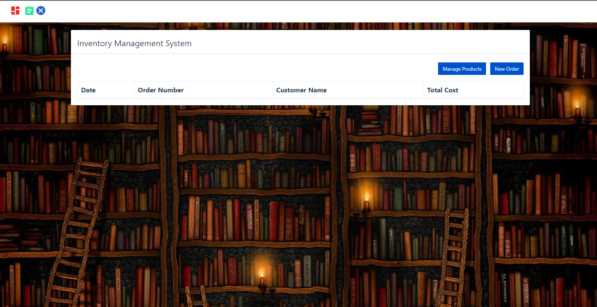
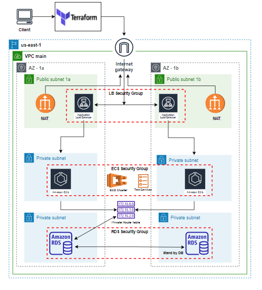
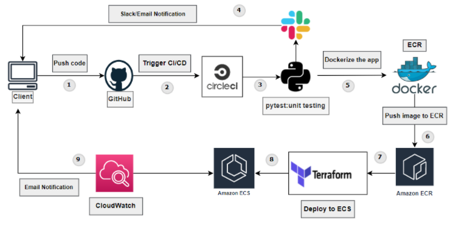
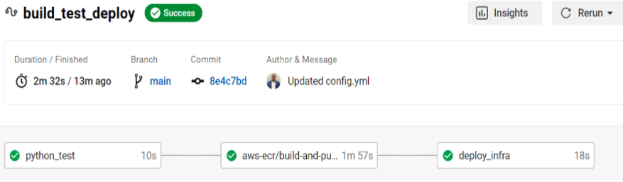

 <h1 align=center>Final Project: Inventory Management Application</h1>

The source codes and other resources for for the application deployed can be found in this **[link here](https://github.com/codebasics/python_projects_grocery_webapp)** on [codebasics](https://github.com/codebasics).

👉Link to instructions from Kura Labs: [here](https://github.com/kura-labs-org/FINAL_PROJECT_C2)

## Goal:
In this python project, we will build an inventory store management application. It will be **three-tier** application with:

1. **Front end**: **UI** (User Interface) is written in **HTML/CSS/Javascript/Bootstrap**
2. **Backend**: Python and Flask
3. **Database**: RDS mysql
4. Here is how the app lauched:



## Architecture:

We used a three-tier architecture: in each availability zone, there are in the:
  * **First tier**: Public subnet, has an application load balance and a nat gateway.
  * **Second tier**: Private subnet, hosts the frontend image which is running in a container (ECS Fargate).
  * **Third tier**: Private subnet, has the RDS database.
All frontends talk to the same database; the second one is a stand by database in case the first one fails.



## Software Tools:

   * **AWS account**: set up an [account](https://docs.aws.amazon.com/polly/latest/dg/setting-up.html) and a user.
   * **AWS:** ECS, ECR, RDS, EC2, CloudWatch for monitoring.
   * **CI/CD Pipeline:** Circle CI is used for continuous integration
   * **Infrastructure as Code (IaC):** Terraform is used for provisioning the architecture
   * **Testing:** Pytest is used to test the application. 

## Procedure:

#### The CI/CD pipeline



#### Pipeline in CirceCi
Note that the Terraform folder and the CircleCI folder is set up so that once there is a new commit for code, it triggers the CI/CD pipeline.<br>
An example od the result in CircleCi is shown below.



### Part 1 - Building the app locally - Setting up RDS database and deploying on the cloud

1. Create an Ubuntu/Linux AWS [EC2 instance](https://medium.com/@jameshamann/setting-up-an-ubuntu-ec2-instance-from-scratch-78a166167a22).
2. Install Nginx. Use this [link](https://www.nginx.com/blog/setting-up-nginx/).
3. Copy the files to this path. You can also [clone](https://docs.github.com/en/repositories/creating-and-managing-repositories/cloning-a-repository) the [repository](https://github.com/codebasics/python_projects_grocery_webapp) and delete files that are not used for the application. 
```
cd /usr/share/nginx/html
```
4. Create a virtual environment to [run the flask app](https://pythonhow.com/python-tutorial/flask/Using-a-virtual-environment-with-your-flask-app/). 
5. Install reqirements:
```
pip install flask
pip install mysql-connector-python
```
6. Activate the virtual environment by running the commands below.
```
python -m venv .venv
Souce_path_to_file/.venv/scripts/activate
```

If your using bash, go to windows powershell as administrator and **Set-ExecutionPolicy Unrestricted**.<br>
Now, go to Scripts folder and run `. activate` , this will allow you to use **venv**.
```
python -u "c:\Users\...path_to_file...\server.py"
```
This will run the Python flask locally.

7. Install mysql client on the EC2. You can follow this [tutorial](https://linuxconfig.org/install-mysql-on-ubuntu-20-04-lts-linux).
8. Created [RDS](https://docs.aws.amazon.com/AmazonRDS/latest/UserGuide/USER_CreateDBInstance.html) database on AWS.
9. Set up the schema of the data tables on your local MySQL Workbench database and [imprort](https://dev.mysql.com/doc/workbench/en/wb-admin-export-import-management.html) it to the RDS database on AWS.
10. Connect to the RDS from the EC2 through MySQL client; use this command:
```
sudo mysql -h {endpoint of your database} -P 3306 -u {database_username} -p
```

This will prompt you to enter the database password.<br>
After you input the password, your web app is now connected to your database.

### Part 2 - Infrastructure as Code (IaC):

Provisionning the infrastructure

  1. Install [terraform](https://linoxide.com/install-terraform-on-ubuntu-20-04/).
  2. The [Terraform](https://github.com/ibrahima1289/kura-g5/tree/main/terraform) folder contains the files used to provision the infrastructure.

### Part 3 - Circle CI Set up

Used resource from [punkdata](https://github.com/punkdata/python-flask/blob/master/.circleci/config.yml).

### Part 4 - Setting up the login page
*The login page is still a working progress project.*

Instead of building a frontend for the login page, we decided to use [AWS Cognito](https://cran.r-project.org/web/packages/cognitoR/readme/README.html).<br>
Follow the link for the setup.

**Note:** You **must** set up [HTTPS](https://techexpert.tips/nginx/enable-https-nginx/) on Nginx before setting up the URLs under `App Integration > App Client Settings`.

*The URLs must be ‘https’, with exception of urls with localhost where ‘http’ is allowed. Here is the [source](https://medium.com/swlh/authentication-authorization-for-web-apps-using-aws-cognito-21548bb3b86)*.

For mor information visit the [Amazon Cognito - Developer Guide](https://docs.aws.amazon.com/cognito/latest/developerguide/cognito-dg.pdf).

### Part 5 - The Front-End Modifications

After adding **AWS Cognito** for authentication, we did not have a way to log out of the application once we have loged in. <br>
For this, we added a **logout** button. We used an icon from [zmdi](https://www.templateshub.net/demo/Mentor-Bootstrap4-Admin-Dashboard-Template/icons-material.html). <br>
Below is the added code for the logout button in **''blue x''** in the [index.html](https://github.com/ibrahima1289/KURA_GROUP_5/blob/main/frontend/index.html) file line 37, [order.html](https://github.com/ibrahima1289/KURA_GROUP_5/blob/main/frontend/order.html) file line 35, and the [manage-product.html](https://github.com/ibrahima1289/KURA_GROUP_5/blob/main/frontend/manage-product.html) file line 36.

```
<a href="logout.html">
    <i class="zmdi zmdi-close-circle" title="Logout"></i>
</a>
```
See picture below.


### Part 6 - Monitoring

#### Integrating CircleCI and Slack to receive alerts

1. Create a new slack channel solely for the purpose of receiving alerts.
2. Click on the button listing the number of channel members and go to Integrations.
3. Click on Add an App, then click on App Directory.
4. Search for CircleCI and add it to Slack.
5. Choose the channel where you want the notifications to go, then click on Add Integration.
6. The landing page will have instructions on how to complete integration, click on Save Integration.
7. On CircleCI, navigate to the Organizational Settings of your project.
8. Click on Contexts and create a new one.
9. Add two environmental variables, **SLACK_ACCESS_TOKEN** and **SLACK_DEFAULT_CHANNEL**.
10. Inside the config.yml file, add the slack orb, and add the context key to as many jobs in the workflow as you need.
11. Whenever the pipeline deploys, CircleCI will see the context key and grab the environment variables associated with it.
12. Refers to this [documentation](https://support.circleci.com/hc/en-us/articles/360044674612-Using-Slack-Integrations-with-CircleCI?utm_source=google&utm_medium=sem&utm_campaign=sem-google-dg--uscan-en-dsa-maxConv-auth-brand&utm_term=g_-_c__dsa_&utm_content=&gclid=Cj0KCQiAubmPBhCyARIsAJWNpiO995I2GCDNU2q5_BcF8CxrH5Q-rWIReVQUI4QAXHHcxfcc9kUFciUaAgQmEALw_wcB) for more details. 

#### Configure Cloudwatch

For [CloudWatch](https://github.com/ibrahima1289/kura-g5/blob/main/terraform/cloudwatch.tf) and [SNS](https://github.com/ibrahima1289/kura-g5/blob/main/terraform/sns.tf), see the [terraform](https://github.com/ibrahima1289/kura-g5/tree/main/terraform) files.

### Part 7 - Possible Improvements

1. Security - Integrate AWS Cognito
2. Use HTTPS for encryption
3. Scalability: add scaling groups 
4. Microservices (Containerize the backend in order to separate it from the frontend)

## Sources visited:
1. Amazon Cognito, [NGINX Plus](https://docs.nginx.com/nginx/deployment-guides/single-sign-on/cognito/#cognito-domain-name).
2. Implementing [AWS Cognito](https://cran.r-project.org/web/packages/cognitoR/readme/README.html).
3. Configure [https](https://techexpert.tips/nginx/enable-https-nginx/) for NGINX.
4. [MENTOR](https://www.templateshub.net/demo/Mentor-Bootstrap4-Admin-Dashboard-Template/icons-material.html), adding icons in HTML.
5. Run Python [unit test](https://www.techiediaries.com/python-unit-tests-github-actions/).

## The team

